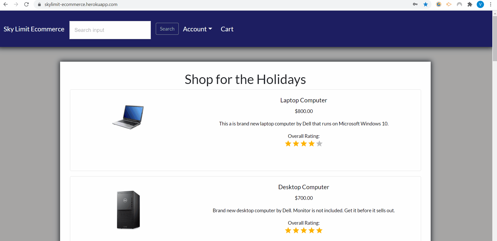

# SkyLimit Ecommerce

Deploy Link: https://skylimit-ecommerce.herokuapp.com/

## Description

A ecommerce website where buyers can shop for items, search for items by a keyword, browse for items via category, add items to their cart or wishlist, make purchases for products, leave reviews for products, and view average rating for both products and sellers.





# Table of Contents
- [Installation](#installation)
- [Dependencies](#dependencies)
- [Features](#features)
- [Usage](#usage)
- [Questions](#questions)

## Installation

To install, run the following command:

```
npm i
```

## Dependencies

App uses the following dependencies: 
- @material-ui/core
- @material-ui/lab
- Stripe, @stripe/react-stripe-js, & @stripe/stripe-js
- Axios
- Bcrypt & mongoose-bcrypt
- Express & express-session
- Mongoose
- Multer
- Passport & Passport-local
- React, react-dropdown-select, react-phone-input-2, react-phone-number-input, react-select and more.


## Features

Skylimit Ecommerce has the following features:

- Sign up for an account.
- Authenticate account sign in via bcrypt and Mongoose.
- Edit account details (Edit name, email, phone number, change password, add/store multiple addresses and set a address as the default address).
- Users can only update their own account, this is done by having the server check who is logged in making the account edit.
- Post products to sell.
- Upload product images using Multer and store those product images on the database rather than storing them in a folder/directory on the server. This makes it so that Heroku server does not drop stored images like in a previous project.
- Display product images on screen by converting the binary data so front end can read.
- Uses react select for a creatable dropdown select menu. Users can search through dropdown menu, create a custom dropdown select option or select one option from dropdown. This allows user to create custom categories for products.
- Sellers can update product details.
- Middleware is in place so only product sellers can update a product
- Search for products, uses smart search so it scans for keywords inside names, descriptions, and categories of products. Search is not case sensitive.
- Search bar includes autocomplete suggestions based on what the user is typing. Autocomplete suggestions also include a list of all product names.
- Browse products in home page.
-View product Detail page.
- Buyers can add or remove product to their cart and/or wishlist.
- If user adds item to cart or wishlist they will instead see "Remove from" cart or wishlist buttons.
- Buyers can place orders and view previous orders.
- At checkout a price comparison is made to make sure buyer is submitting for the same price they see on screen, this is incase the seller changes the price right before the buyer orders.
- After ordering a product, user cart is emptied.
- After ordering, if the buyer revisits the product page they will see the add to cart button now says "Buy Again".
- After ordering, buyer will now also see a "Write a review" button which will allow the users to write a review of the product and leave a 1-5 star review rating of the product.
- Reviewers can go back and change their reviews or rating of a product at any time.
- Reviewers can delete a review.
- Only reviewers can edit or delete their own reviews. Middleware was made to accomplish this, this middleware is identical to the middleware user to make sure only product sellers can edit and delete their own products.
- Other buyers can view and read reviews product reviews.
- The review average rating is calculated for each product and is display on screen with an accuracy of 0.1. So other users can see the average rating for products reviewed by buyers and if it scored low or high.
- Sellers cannot review/rate their own products.
- Buyers who have not yet purchased a product cannot review/rate a product. Nor can people who are not signed in.
- Only buyers who have purchased the product in the past can leave a review/rating.
- Buyers/reviewers cannot post multiple reviews and ratings on a product, they can only post 1 review per product.
- Buyers can view a merchant page and see a merchant rating and all of the products posted by that merchant.
- The average rating for sellers/merchants is calculated and can be viewed on their merchant page. This is done by finding all of the reviews left for all of the products that have been posted by that merchant. Then the total is added up then divided for an average rating.
- Even if a seller deletes/removes a product, the ratings for that product remains on the database and still counts towards their average merchant rating. As mentioned before, only the review can change or delete that rating.
- Products and sellers are associated with each other on the mongoose db.
- Reviews are associated with their products, the seller, and the reviewer.
- 404 page is available if page does not exist. If user sees a product or merchant that does not exist, they are redirected to the 404 page. 
- If user visits a edit review page or a edit product page or delete review page or delete product page of a review/product that does not belong to their own account, they are redirected to a 404 page.
- Website has intelligent page redirects which will remember which page the user was trying to visit after they are redirected to the login page. In other words, certain pages you will have to be authenticated for the user to visit. Take the Account Settings page or the edit product page as a example. If the user tries to visit one of these pages while logged out/unauthenticated, they will get kicked out and redirected to the login page. After they login, instead of being redirected to the home page, it will remember which page the user was trying to visit and then take them to that page. For example, if you visit the Account Settings while unauthenticated, it redirects you to the login page. After you login, it then redirects you to the account settings page you were trying to visit before, instead of moving you to the home page and then making you go through all of that again, the login redirects are intelligent and take you to the page you were trying to visit while unauthenticated. This creates a smooth user experience that is seamless when someone is kicked out after their token is expired and they have to log back in. It makes the website more user friendly and easier to navigate when having to constantly log in and authenticate an account.
- As mentioned before, the Sign Up also has a intelligent redirect that will remember what page the user was on after they sign up. Just like the log in intelligent redirect, if a user is unauthenticated and clicks on the "Add to Cart" button or the "Add to wishlist" button, they will be redirected to the login. If they click on the sign up button instead to sign up for an account, they will be directed to the sign up page. After the user successfully signs up for an account, they are then redirected back to the product page they were viewing and trying to add to their cart. Again, instead of kicking the user out and making them find their product page again, this feature makes the experience seamless and less inconvenient as they are taken back to the page they were on while unauthenticated. If the user switches back and forth between login and signup pages, it still remembers what page they were on based on the url. The Url is what remembers which page the user was trying to visit. As long as that does not change, they are redirected to the correct page. Again, this makes it a better user experience but also easier to develop with when you are constantly restarting the server and having to re-login all the time, this method remembers which page you were on before the server restarted. So it also has pros for developers in test mode.
- Website is mobile responsive meaning it will react to different screen sizes. If website shrinks, the div columns stack on top of each other. The navbar will also collapse and then show a button that the user can use to expand. App has been tested on mobile devices and on smaller screen sizes.
- App uses an handful of media queries, not too many to optimize mobile responsiveness.
- Buyers cannot make a purchase when the cart is empty.
- Users can browse products by category in the navbar. Designed it so that it is easy for a developer to add ore remove extra browsing pages by using a template browse page. For ecample there is currently a Holiday tab where users can shop specifically for holiday season gifts. This can be easily removed and a different one could be added when the season changes and it is no longer the holiday season.
- When viewing a product, the user will also see items related to that product on the product page.

Features to be Added:

- Create real monetary transactions. Right now the website can do test transactions with Stripe using test API keys and test credit cards. All I would have to do is swap out the test API keys with the real API keys and use a real credit card number to make a real transaction.
- Email authentication for when a user signs up for an account.
- Two-factor authentication for when someone signs into an account from a new device.
- I could start my own bsuiness with this website, turn the website into a live site where I am selling real stuff, post my own products on there, and make make it so my account is the only account that can make purchases.
- Request for your account be be closed.
- Collect user data based of the user's browse history, purchase history, search history, cart history, or wishlist history. Us that data to present and suggest more relevant products.
- Upon a product purchase, send an email notification to the seller that an order has been made. Allow sellers to see a list of orders somewhere on the site to better manage these purchases.
- Generate delivery package slips that sellers can attatch to their packages for products.
- Add an order tracking system where buyers and sellers can track their order status and the package that contains their order.
- Add an inventory system by adding quantities to products. Make it so the website responds to these quantities. Allow customers to order a quantity of more than 1 per product.
- Fix logout feature. On Heroku, sometimes when the user trys to logout, the attempt fails. There has been several attempts previously to patch this but none were succesful.

## Usage

To start, run:

```
npm start
```

To make a production build, run:

 ```
 npm run build
 ```
 
## Questions

If you have any questions feel free to contact: 
 
[GitHub](https://github.com/vmcgargill) 

[LinkedIn](https://www.linkedin.com/in/vincent-mcgargill-b6244660/) 
 
Email: [vincentmcgargill@gmail.com](mailto:vincentmcgargill@gmail.com)

Portfolio: https://vmcgargill.github.io/portfolio/#/
